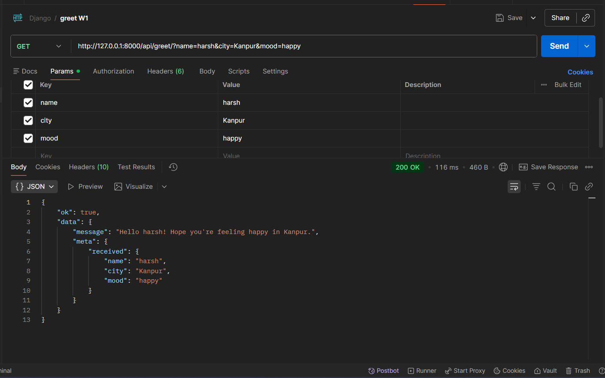

# Greet API – Hexagonal Architecture (Django)

## Overview
This project implements a simple **GET API** using Hexagonal Architecture (Ports & Adapters) in Django.

The API accepts query parameters and returns a greeting in JSON format.

---

## Architecture

```
greet/
 ├── domain/
 ├── application/
 └── adapters/in_http/
```

- **Domain** → Business logic  
- **Application** → Use case layer  
- **Adapters** → HTTP interface  

---

## Endpoint

### GET `/api/greet/`

### Example Request
```
http://127.0.0.1:8000/api/greet/?name=Harsh&city=Kanpur&mood=awesome
```

### Example Response
```json
{
  "ok": true,
  "data": {
    "message": "Hello Harsh! Hope you're feeling awesome in Kanpur."
  }
}
```

---

## Postman Test



---

## Run Locally

```bash
pip install django djangorestframework
python manage.py runserver
```

---

**Author:** Harsh Shekhawat  
