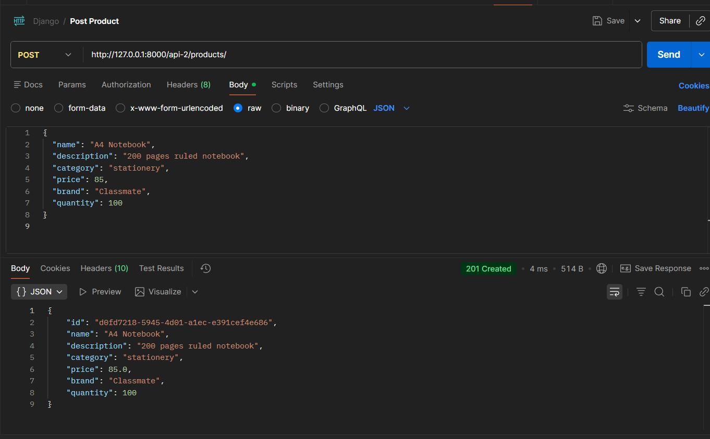
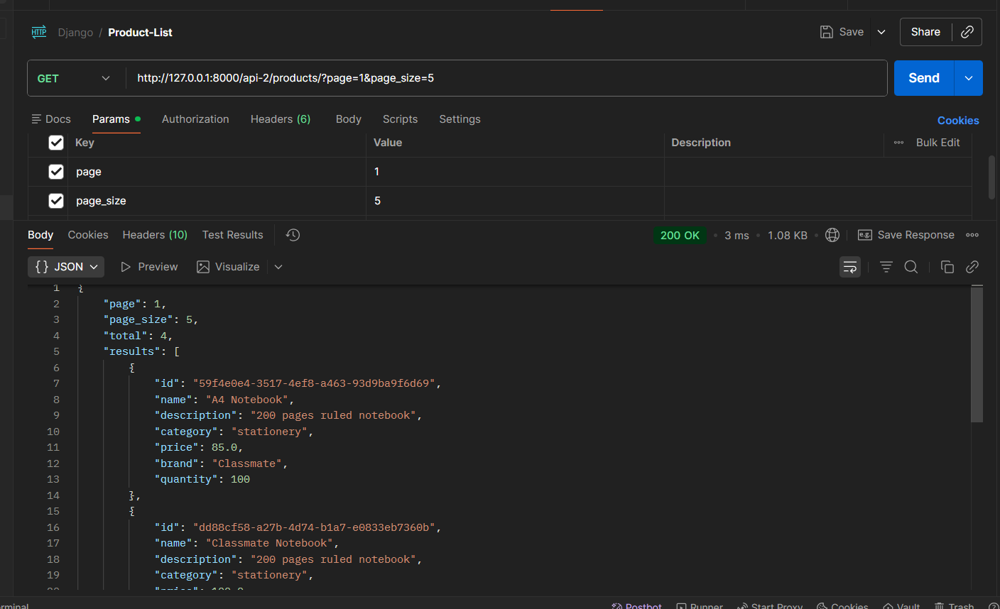
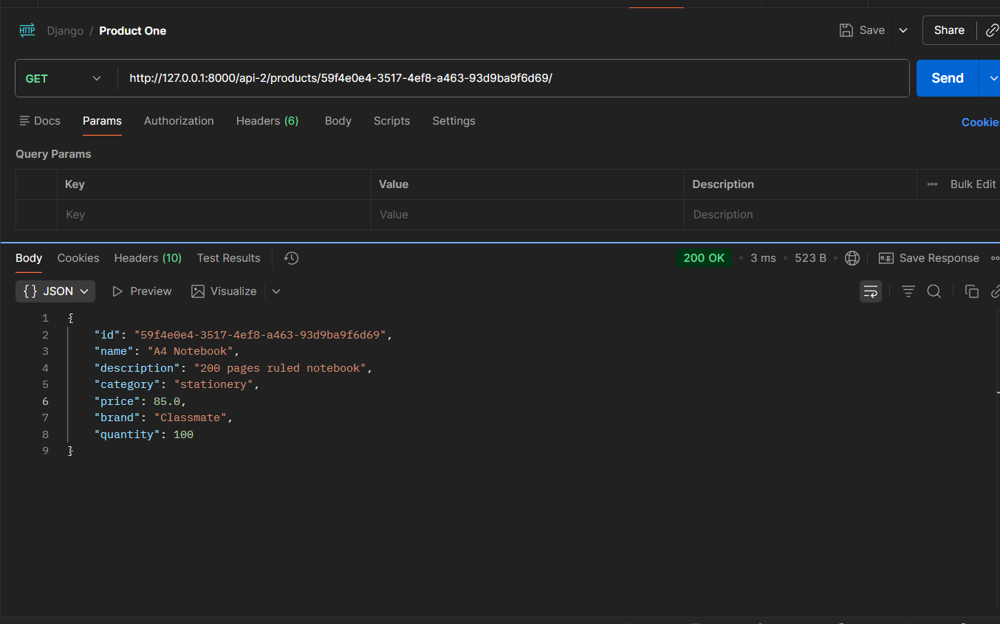
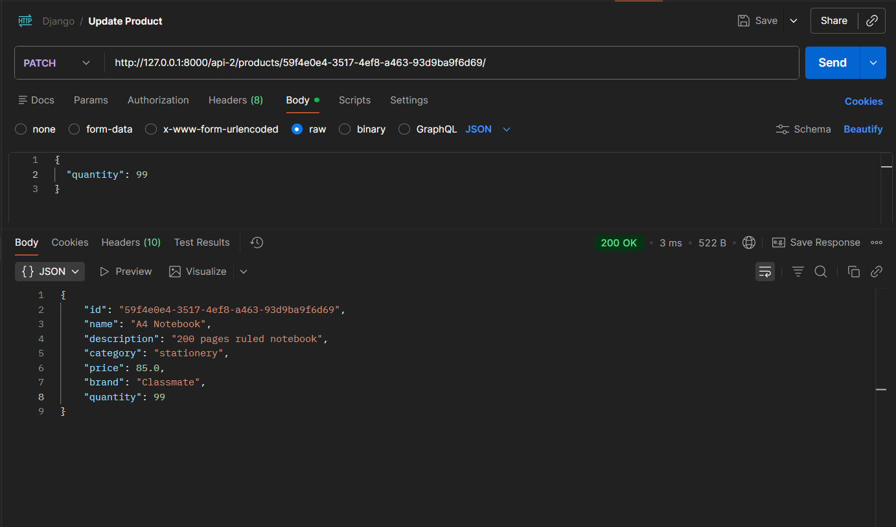
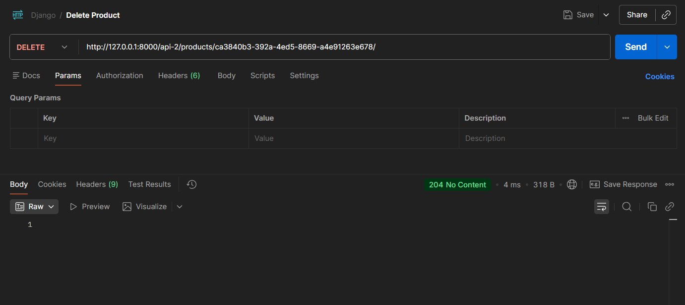

# Inventory Management System – Week 2

Basic Inventory Management APIs built using **Django** and **Django REST Framework (DRF)**.

⚠️ Data is stored in-memory (dictionary-based). Server restart will clear all products.

---

## 🚀 Tech Stack
- Python
- Django
- Django REST Framework
- Postman (API Testing)

---

## ⚙️ Setup

```bash
python -m venv venv
venv\Scripts\activate
pip install django djangorestframework
python manage.py runserver
```

Base URL:
```
http://127.0.0.1:8000/api-2/
```

---

## 📡 API Endpoints

### Create Product
POST `/api-2/products/`

```json
{
  "name": "Mouse",
  "description": "Wireless",
  "category": "electronics",
  "price": 799,
  "brand": "Logitech",
  "quantity": 10
}
```

### Get All Products
GET `/api-2/products/`

Pagination:
```
/api-2/products/?page=1&page_size=5
```

### Get Single Product
GET `/api-2/products/<id>/`

### Update Product
PATCH `/api-2/products/<id>/`

```json
{
  "quantity": 25
}
```

### Delete Product
DELETE `/api-2/products/<id>/`

---

## 📸 Postman Screenshots

Create a folder named `screenshots/` and add:

- create.png
- list.png
- single.png
- update.png
- delete.png
- error.png

Then include:








---

## 👨‍💻 Author
Harsh Shekhawat  
Week 2 – Inventory Management System